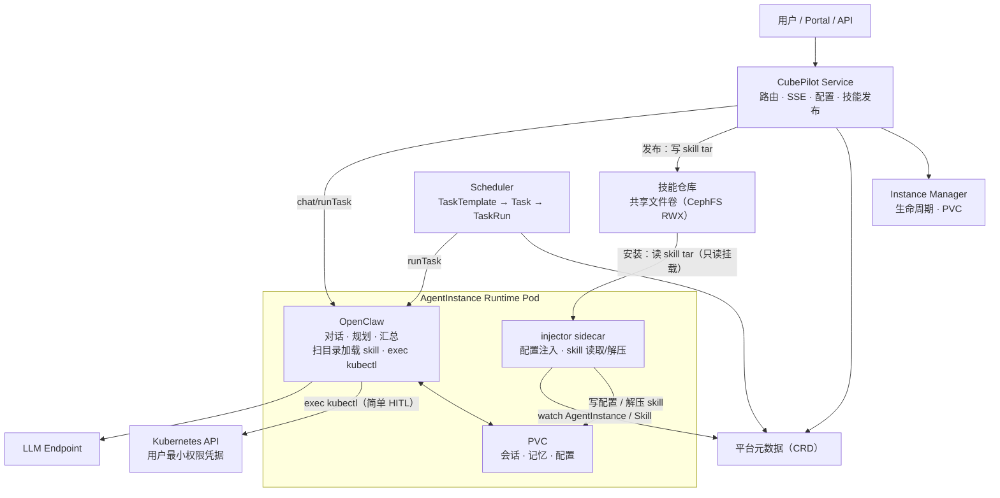

# CubePilot · Cloud for Agents 简化设计

**状态：** Draft
**原则：** 平台能力 API 化；Agent 负责理解、规划和汇总，平台负责执行、授权和记录。

> CubePilot 的核心是“每个用户一个管理 CubeStack 的 Agent”。本文保留未来扩展的接口，但不将 Agent 市场、多 Runtime、代码托管或通用 Agent 云作为当前架构前提。

---

# 1. 目标与边界

## 1.1 核心功能

- Portal/API 中与用户自己的平台管理 Agent 对话，并获得流式回答。入口：各页面右下角按钮弹浮窗对话（session 全局统一、不按模块区分），cubepilot 模块页另设独立对话 tab（非弹窗）。
- Agent 以用户最小权限查询或操作已支持的 CubeStack 资源。
- 用户创建定时巡检任务，获得带证据链的报告。
- 每个用户的会话、记忆和运行数据相互隔离，并能跨实例重启保留。
- 平台管理实例生命周期；写操作加**尽力而为的简单 HITL**（命令匹配命中即确认，不保证完全防住）。

## 1.2 不属于当前核心

- 不实现 Agent 市场、跨用户共享、用户自定义容器或多 Agent 协作。
- 只运行 OpenClaw，不实现多个 Runtime。
- 不为每个 CRD 编写专用工具；通用 Kubernetes 能力基于用户权限动态发现和执行。
- 不建设独立 Tool Gateway、Credential Registry、统一模型代理或统一 fallback（用 OpenClaw 原生 skill）。

这些能力可在不改变本文接口的情况下增加，但不是当前设计的前置条件。

## 1.3 核心决策

1. 一个内置模板：`agent-for-cloud`。
2. 每用户一个实例：`(user, agent-for-cloud)` 对应一个 Runtime Pod 和一个 PVC。
3. 一个 Runtime 接口、一个实现：平台依赖 `AgentRuntime`，当前唯一实现是 `OpenClawRuntime`。
4. 工具用 **OpenClaw 原生 skill + exec kubectl** 执行（用户最小权限 + RBAC 兜底）；写操作加**尽力而为的简单 HITL**（命令匹配命中即确认，不保证防住所有变体）。MCP Gateway 是阶段二统一执行边界，阶段一不建。
5. 能力分两层：generic（kubectl 执行 + schema 发现，零登记）+ skill（经**技能市场**发布、一键安装的 SKILL.md 目录）。不单独建 Model CRD——模型内联在 AgentTemplate 的 `models` 列表（支持外部）。
6. 声明配置在控制面，私有状态在 PVC：PVC 不作为 Agent 配置真源。

---

# 2. 总体架构



> 阶段一用 OpenClaw 原生 skill + exec kubectl 执行，写操作加尽力而为的简单 HITL；MCP Gateway 是阶段二统一执行边界，阶段一不建。

| 组件 | 职责 | 不负责什么 |
|---|---|---|
| Portal/API | 认证、对话入口（浮窗 + 独立 tab）、配置、任务与报告查询 | 不持有 Agent 会话状态 |
| CubePilot Service | Agent 路由、SSE 转发、chat/runTask 转发（OpenClaw 客户端）、实例查找、技能发布（写技能仓库 + Skill CRD） | 不执行 LLM 编排或 kubectl |
| Instance Manager | 创建、停止、自愈 Pod；挂载 PVC 和凭据 | 不理解用户自然语言 |
| injector sidecar | 配置注入、skill 读取：watch CRD → 从技能仓库读取 + 渲染配置 + 解压 skill 写 PVC | 不做 Agent 规划 |
| OpenClaw 进程 | 对话/规划/汇总；扫目录加载 skill；exec kubectl（简单 HITL） | 不决定 RBAC 或管理 Pod |
| Scheduler | 触发任务、调用实例、写入 TaskRun | 不持有用户资源权限 |

## 2.1 请求路径

1. Portal 通过 OIDC 认证，向 Service 发送消息。
2. Service 定位用户实例；不存在或不健康时由 Instance Manager 拉起。
3. Service 调用 `AgentRuntime.chat` 并转发统一事件流。
4. Runtime 加载 skill，需要工具时经 exec 执行 kubectl（写操作命中简单 HITL 规则即确认）。
5. RBAC 是最终授权边界，无权限被 API Server 拒绝，返回结构化结果。
6. Runtime 汇总结果，将私有会话状态写入 PVC。

## 2.2 依赖的平台存储（Ceph）

CubePilot 依赖平台安装时提供的 Ceph 存储：

| 存储 | 用途 |
|---|---|
| 共享文件卷（CephFS，RWX） | 技能仓库，存技能 tar 包（§3.4） |
| 文件型 StorageClass | 每实例数据 PVC（RWO，存会话/记忆/配置） |

**平台安装时需提供**：

- 一个**共享文件卷**（CephFS，RWX，如 `cubepilot-skills`）——技能仓库；
- 一个**文件型 StorageClass**（如 `cubepilot-data`）——供每实例数据 PVC 使用。

---

# 3. 核心对象与数据归属

## 3.1 AgentTemplate

当前只有一个平台内置模板 `agent-for-cloud`。它不是完整 Agent Registry，也不是可由用户创建的市场对象。

```yaml
apiVersion: ai.cubestack.io/v1alpha1
kind: AgentTemplate
metadata:
  name: agent-for-cloud
spec:
  runtime: OpenClaw
  displayName: 平台管理助手
  defaultModel: deepseek-v4-flash          # 从 models 里选默认
  models:                                  # 内联模型清单（无独立 Model CRD）
    - name: deepseek-v4-flash              # 目录名 = 选择 key = 后端模型名
      endpoint: https://api.deepseek.com   # 必填，OpenAI 兼容 base URL
      credentialRef: { name: cubepilot-llm }  # 可选；public 模型没有
  instructions: |
    你是 CubeStack 平台管理助手。优先使用已登记能力；
    不确定资源或权限时先解释并请求用户澄清。
  skills: [dev-environment, inference-service, cluster-inspection]   # 引用技能（技能市场发布，见 §3.4）
  confirmPolicy: ConfirmWrites            # 确认策略：写操作需用户确认（读直放）
```

模板变更生成不可变 `revision`，供审计与回滚。实例引用模板名（不钉版），模板更新在下次实例 reconcile 或重启时生效，不能静默改变正在运行的行为。确认策略（`confirmPolicy`）定义在 **AgentTemplate 层而非 skill 层**：不同 AgentTemplate 复用同一 skill 时可有不同确认策略；skill 只承载语义与脚本、不携带权限/确认字段（权限由 RBAC 决定，确认由 AgentTemplate 的 `confirmPolicy` + 简单 HITL 执行，阶段二收敛到 MCP Gateway）。

## 3.2 AgentInstance

每个用户有一个 AgentInstance，保存受模板约束的用户配置和运行状态。

```yaml
apiVersion: ai.cubestack.io/v1alpha1
kind: AgentInstance
metadata:
  name: zhang-wei-agent-for-cloud
spec:
  owner: zhang.wei
  templateRef: agent-for-cloud           # 引用模板名（不钉版；模板更新在下次 reconcile/重启时生效）
  selectedModel: deepseek-v4-flash         # 从模板 models 里选（覆盖 defaultModel）
  enabledSkills: [dev-environment, inference-service, cluster-inspection]   # 启用的 skill 子集
  userInstructions: "回答尽量简洁，使用中文。"
  dataVolume: { pvc: pvc-zhang-wei-agent-for-cloud }
  identity: { mode: user, principalRef: { userRef: zhang.wei } }
status:
  phase: Ready
  podName: agent-zhang-wei-agent-for-cloud
```

允许覆盖的字段只有模型选择（`selectedModel`，从模板 `models` 里选）、skill 子集和 `userInstructions`。切换模型 = 改 `selectedModel` → 重新解析并注入（§4 配置注入）；skill 类变更靠文件监听热重载，其余配置变更不支持热重载时退化为重启 OpenClaw（会话与记忆在 PVC，不丢失）。`userInstructions` 仅追加用户偏好，最终指令由平台安全与执行约束、模板 `instructions`、用户指令依次组合；它不能删除、替换或降低模板中的安全边界、工具规则和身份限制，也不得扩大模板定义的能力或权限。

**实例开通（自服务）**：用户通过 Portal「Agent 配置」页或 `POST /api/instances` 开通自己的实例（owner 恒为请求者，服务端强制，防越权；读列表同样只返回自己的实例）。重复开通幂等返回已存在实例，不重复拉起 Pod/PVC。operator 控制器负责后续生命周期（Pod/PVC/Service 创建与自愈），API 只写 AgentInstance CR。阶段一预置用户（values 配置的 bootstrap 名单）由 operator 启动时创建；生产环境不依赖该名单，管理员在页面上开通或 `kubectl apply` 均可。

## 3.3 模型（内联，无独立 CRD）

不单独建 Model CRD：模型配置**内联在 AgentTemplate 的 `models` 列表**，每项含 `name`（目录名 = 选择 key = 网关 provider key = 后端模型名）+ `endpoint`（必填，OpenAI 兼容 base URL）+ `credentialRef`（可选，`LocalObjectReference`；public 模型没有）。

- 所有模型都是具体端点；`defaultModel` 从 models 里选默认，`AgentInstance.selectedModel` 覆盖。
- 网关配置（providers + allowlist + 网关 token）由 operator 从模板 models + 凭据 Secret **声明式生成**，写入 `openclaw-config` Secret；不再由安装时环境变量决定。
- 加一个 LLM = 往模板加一条模型（+ 非 public 时一个凭据 Secret），Portal「LLM 配置」即可完成。
- 多模型路由/模型目录治理是阶段二的事。

## 3.4 技能市场（Skill）

能力分两层：

- **generic**：平台内置的 kubectl 执行 + schema 发现，零登记，自动覆盖全部 CRD。
- **skill**：领域知识 + 受控脚本，是**多文件目录**（`SKILL.md` + 可选 `scripts/`、`references/`），经**技能市场**发布、一键安装到实例。

### 技能形态

skill = 一个目录（打包成 tar），`SKILL.md` 是入口：

```text
harbor/
  SKILL.md         # 用途、命令、示例
  scripts/         # 受控脚本（可选）
  references/      # 参考资料（可选）
```

### 技能登记（Skill CRD）

`Skill` CRD 登记「有什么技能、在哪、什么版本、谁可见」，内容在技能仓库（共享文件卷），不塞 CRD：

```yaml
apiVersion: ai.cubestack.io/v1alpha1
kind: Skill
metadata:
  name: harbor
spec:
  displayName: 镜像管理
  description: 查询 / 清理 Harbor 镜像
  visibility: Platform            # Platform | Tenant | User
  source:
    type: Path                    # Path | S3（判别字段；阶段二启用对象存储时用 S3）
    path: skills/harbor/v1.tar.gz # 仅 type=Path：共享文件卷内路径（相对挂载点），含版本号，不可变
    s3:                           # 仅 type=S3（阶段二）：对象存储寻址
      bucket: cubepilot-skills
      key: harbor/v1.tar.gz
    sha256: "..."                 # 与后端无关，内容校验/审计指纹，Portal 发布自动回填
status:
  phase: Available                # Available | Unreachable
  conditions: [...]
```

`source.type` 是判别字段（`Path | S3`），阶段一仅 `Path`；`path` 与 `s3` 是互斥臂字段，由 CEL 校验保证与 `type` 一致（`type=Path` 时必须有 `path` 且不能有 `s3`，反之亦然），非法组合被 API server 拒绝。`source.sha256` 可选：Portal 拖拽上传时后端自动计算回填；手动 `kubectl apply` 可留空，此时以 `path` 中的版本号作为审计标识、完整性校验交给共享文件卷传输层。

### 发布与安装

- **发布（模块/管理员）**：Portal「技能管理」页拖拽上传 skill 目录 → 后端打包写入技能仓库共享文件卷（先写临时文件再原子 rename）+ 建 `Skill` CRD。
- **安装（用户）**：Portal「技能市场」浏览搜索 → 点「安装」→ 后端把技能名加入该实例 `enabledSkills` → injector 从共享文件卷（只读挂载）读取 tar 解压到 workspace/skills → OpenClaw 文件监听热加载。

技能仓库后端（共享文件卷 ↔ 对象存储）对 `Skill` CRD 与加载流程透明，差异仅在 `source` 的寻址方式与 injector 取包方式（挂载点读取 vs 网络拉取）：切对象存储时改 `source.type` 为 `S3` 并填 `source.s3`，其余不变。阶段二放开用户私有技能、需要对象级 ACL 时可切回对象存储，不影响 CRD 与热重载。

AgentTemplate 用 `skills: [...]` 声明默认启用，实例 `enabledSkills` 是用户启用的子集。阶段一只有平台级技能；用户私有技能（`visibility: User`）阶段二放开。

generic 是默认能力：执行以实例 owner 的最小权限凭据进行（RBAC 是授权边界），schema 发现见 §5.3；平台不必为每个新 CRD 登记工具。写操作是否需确认由 AgentTemplate 的 `confirmPolicy`（§3.1）决定。

## 3.5 TaskTemplate、Task 与 TaskRun

三者同构「模板 ≠ 实例 ≠ 执行」：`TaskTemplate` 定义「做什么」（参数化、可复用）；`Task` 定义「谁 + 何时做」（用户绑定模板与调度）；`TaskRun` 记录「这次做得怎么样」（一次不可变执行记录）。

```yaml
apiVersion: ai.cubestack.io/v1alpha1
kind: TaskTemplate
metadata:
  name: daily-inspection
spec:
  displayName: 每日集群巡检
  instruction: |
    以只读方式巡检集群（get/list/watch/logs）：检查节点 Ready 与压力、
    GPU 健康、异常 Pod、PVC 使用率与平台组件；异常附证据链并按 P0/P1/P2 分级；禁止写操作。
    巡检范围：{{scope}}。
  paramsSchema:
    - { name: scope, default: All, enum: [All, NodePool, Project] }
  requiredPermissions: { level: ClusterRead }
  skills: [cluster-inspection]              # 声明任务所需 skill（执行时解析当前版本）
  defaultCron: "0 2 * * *"                # 创建向导的默认调度提示；以 Task.cron 为准
```

```yaml
apiVersion: ai.cubestack.io/v1alpha1
kind: Task
metadata:
  name: zhang-wei-daily-inspection
spec:
  owner: zhang.wei
  templateRef: daily-inspection           # 引用模板名（不钉版，下次执行用当前版本）
  params: { scope: all }                  # 只覆盖 paramsSchema 允许的参数
  trigger: Cron                           # Cron | Manual（手动触发）
  cron: "0 2 * * *"
  state: Enabled                          # Enabled | Paused（字符串枚举，不用 bool）
```

```yaml
apiVersion: ai.cubestack.io/v1alpha1
kind: TaskRun
metadata:
  name: zhang-wei-daily-inspection-20260820-020001
spec:
  creatorTaskRef: { name: zhang-wei-daily-inspection, uid: "…" }
  trigger: Cron                           # Cron | Manual
status:
  phase: Completed                        # Pending → Running → Completed / Failed
  startedAt: "2026-08-20T02:00:01Z"
  finishedAt: "2026-08-20T02:02:30Z"
  templateRevision: 7                     # 运行时解析：本次实际用到的模板版本
  skillRevision: 4                         # 运行时解析：本次实际用到的 skill 版本
  summary: { p0: 0, p1: 1, p2: 3 }
  content: "巡检报告全文……"
  error: ""                               # 失败原因
```

模板只回答「做什么」，调度与归属放在 Task 上。`templateRef` 只存名字、不钉版本，执行时解析当前模板（模板更新下次执行生效，不影响正在跑的一次）；因此 Task 上**不固化 skill 版本**——审计由 TaskRun 在运行时记录实际用到的 revision（见 §7）。`params` 只能覆盖模板 `paramsSchema` 允许的参数。阶段一每用户只有一个 `agent-for-cloud` 实例，可从 `owner` 推导，故不写 `agentInstanceRef`（阶段二多 Agent 时再加回）。每次执行前，Scheduler 重新验证用户有效性与授权；失败时写入 TaskRun，不执行工具操作。

## 3.6 数据真源

| 数据 | 真源 | 说明 |
|---|---|---|
| AgentTemplate、AgentInstance、Skill、TaskTemplate、Task、TaskRun | CRD / 控制面数据库 | 声明配置、版本、生命周期、报告 |
| skill 内容（tar 包） | 技能仓库（共享文件卷） | 领域知识 + 受控脚本，经 Skill CRD 引用 |
| 会话、消息、记忆、Runtime 缓存 | 实例 PVC | Agent 私有数据，不复制到平台业务表 |
| 运行指标 | 监控模块 / 日志 | 阶段一预留、验收不要求 |
| 工具调用索引、确认决定、trajectory | —（阶段一不落） | 阶段二 MCP Gateway / 审计体系落地后引入 |

启动时，将 AgentTemplate、AgentInstance、Skill 合并为不可变 `ResolvedAgentConfig` 注入 Runtime（§4 配置注入）；模型（名 + 端点 + 凭据引用）内联在 AgentTemplate.models。PVC 不是配置真源。

---

# 4. Runtime Adapter

平台仅依赖以下窄接口。当前只实现 `OpenClawRuntime`；OpenClaw 的 session、配置文件和原生事件不会泄漏到 Service、Scheduler 或 Instance Manager。

```ts
interface AgentRuntime {
  start(config: ResolvedAgentConfig): Promise<void>
  stop(): Promise<void>
  chat(request: ChatRequest): AsyncIterable<AgentEvent>
  runTask(request: TaskRequest): AsyncIterable<AgentEvent>
  updateConfig(config: ResolvedAgentConfig): Promise<void>
  health(): Promise<RuntimeHealth>
}
```

统一事件：`message_start`、`message_delta`、`tool_call`、`tool_result`、`confirm_pending`、`confirm_resolved`、`message_done`、`error`。

`ResolvedAgentConfig` 包含模型名（内联）、系统指令、启用的 skill 列表、用户身份、凭据挂载位置、PVC 路径；不包含明文密钥。

`AgentRuntime` 接口的实现：**chat/runTask 由 Service 内的 OpenClaw 客户端（HTTP）转发**，生命周期由 operator/K8s 负责；OpenClaw 进程负责对话/规划/汇总、加载 skill、exec kubectl（§5）。

**配置注入**：injector 负责把配置 + skill 内容落到 Pod 的 workspace——渲染系统提示词写 OpenClaw 配置、从技能仓库共享文件卷（只读挂载）读取启用 skill 的 tar 解压到 workspace/skills。OpenClaw 扫目录加载、文件监听热重载。

- **主方案**：injector 以**原生 sidecar** 部署（`initContainers` + `restartPolicy: Always`，先于 OpenClaw 主容器启动并常驻），watch 本实例 AgentInstance 及引用的 AgentTemplate/Skill，合并出 `ResolvedAgentConfig`，渲染系统提示词写配置、从技能仓库读取启用 skill 解压到 workspace/skills。skill 变更经 OpenClaw 文件监听热重载；模型/提示词变更退化为重启 OpenClaw（会话/记忆在 PVC，不丢失）。operator 只负责 Pod 生命周期，不参与 resolve。
- **备选方案**：若不希望 sidecar 持有 CRD 读权限（或避免每 Pod 一个 watcher），改为 operator watch + resolve，经 HTTP API / gRPC 下发配置，sidecar 只拉取写文件。

---

# 5. 工具执行与确认（简单 HITL）

## 5.1 定位

阶段一工具 = OpenClaw 原生 skill + exec kubectl。执行以用户最小权限凭据，RBAC 是最终授权边界。写操作加**尽力而为的简单 HITL**——靠命令匹配（动词/资源白名单或规则）命中即暂停确认，不保证防住所有变体（如 `kubectl delete pod -n ns` 写成 `kubectl delete -n ns pod` 可能匹配不上）。

```text
OpenClaw skill ──► exec kubectl ──► 命令匹配（简单 HITL）──► 命中 → 暂停确认 / 未命中 → 直放
                                     RBAC 兜底（最终授权边界）
```

阶段二：MCP Gateway 统一执行（受控执行、完整 HITL、审计），替换简单 HITL，中间不建过渡组件。

## 5.2 执行约束

- 加载平台内置 generic 工具，以及 AgentTemplate 声明的 skill（技能仓库）。
- Kubernetes 调用使用实例所有者的最小权限凭据，禁止集群管理员凭据。
- RBAC 和资源归属校验是最终授权边界。
- 读操作直放；写操作命中确认规则即暂停确认（简单 HITL，尽力而为，未命中直放）。
- 确认策略由 AgentTemplate 的 `confirmPolicy`（§3.1）决定（默认写操作需确认）。

## 5.3 通用资源发现与执行

执行走 kubectl：OpenClaw exec kubectl（用户 kubeconfig，RBAC 兜底），写操作加简单 HITL。

schema 发现：runtime Pod 挂**两个 kubeconfig**——用户 kubeconfig（操作）+ 平台只读 CRD kubeconfig（读 schema）。内置一个 skill 教 LLM：查 schema 用 `kubectl --kubeconfig=<只读CRD路径> get crd <kind> -o yaml`（或 `explain`），其余操作一律用默认用户 kubeconfig。

资源类型列表由 LLM 用 `kubectl api-resources` 发现；字段校验由 API server 在 apply 时完成（可先 `--dry-run=server`）。skill 提供领域知识与脚本，不替换执行器。

---

# 6. 身份、凭据与隔离

当前只支持**用户身份**：AgentInstance 的 `owner` 与 `identity.userRef` 必须一致，执行（exec kubectl）使用该用户派生的最小权限凭据。

- 用户被禁用、权限回收或凭据轮换时，Instance Manager 更新或撤销实例挂载的凭据。
- TaskRun 在运行前再次校验身份和授权，不依赖创建任务时的权限。
- 凭据由平台托管为 Secret，以文件挂载或短期令牌注入 Pod；Template、Instance、PVC 和审计记录中不存明文密钥。
- 模型端点与凭据内联在 AgentTemplate 的 `models` 里（每项含 endpoint + 可选 credentialRef），凭据引用 Secret、不落明文。用户自带模型凭据属于扩展项。
- 每实例独占 Pod 和 PVC，使用非 root、`readOnlyRootFilesystem`、`seccomp RuntimeDefault`、`drop ALL capabilities`、资源限制和 egress 白名单。

---

# 7. 定时任务与报告

Scheduler 只负责触发与记录，不拥有用户资源权限。

1. 到点后读取 Task，解析 `templateRef` 指向的 TaskTemplate 与当前 skill，并检查 owner 状态。
2. 确认实例可用，调用 `AgentRuntime.runTask`。
3. Runtime 通过 skill + exec kubectl 执行 generic 工具及模板声明的能力（按当前版本）。
4. Scheduler 以平台身份写入 TaskRun；Runtime 不需要 CRD 写权限。

TaskRun 至少记录：Task UID、AgentInstance、Template revision（运行时解析）、开始/结束时间、状态、报告摘要、证据引用和失败原因。完整私有会话仍保留在 PVC，需要长期留档时显式导出。

---

# 8. 观测与扩展边界

## 8.1 观测

可观测性非当前重点，代码预留即可（以下为预留清单）：

- 健康检查：Service、Instance Manager、Scheduler、Runtime。
- 实例指标：启动耗时、就绪率、重启次数、PVC 使用率、并发会话数。
- Agent 指标：首 Token 延迟、完成延迟、模型调用量、工具成功率、确认等待时间。
- 故障隔离：单实例、PVC 或 LLM 失败不得阻塞其他用户或 CubeStack 控制面。

## 8.2 可扩展而不推翻核心的能力

| 扩展 | 保持不变的边界 |
|---|---|
| 第二个 Runtime | 实现 `AgentRuntime` 与统一 `AgentEvent` |
| 外置 MCP Gateway | 实现统一执行边界（受控执行 + 完整 HITL + 审计），skill 语义不变 |
| 用户自建技能 | 阶段二放开 `visibility: User`，用户发布/安装私有技能 |
| 用户自建 Agent | 新增可版本化 Template 和 owner，不改变 Instance/PVC/Executor 模型 |
| 服务身份 | 扩展 identity 与凭据派生，仍由 Executor 执行前授权 |
| 外部下游 | 新增专用 skill/Executor，不将业务逻辑写进 Runtime |
| 模型目录 / 多模型路由 | 阶段二引入独立模型目录与路由，不改变 `AgentRuntime` 接口与 `AgentEvent` 契约 |

## 8.3 待验证项

- OpenClaw 事件与任务执行接口的稳定性；skill 热重载（文件监听）需集成验证。
- 简单 HITL 的命令匹配规则覆盖率（尽力而为，接受漏网）。
- 用户最小权限短期凭据的生成、轮换和撤销。
- PVC 容量、水位清理与实例重建后的会话恢复。

## 8.4 实现状态与已知取舍

实现与设计的对比（阶段一落地记录）已移至独立文档 [implementation-status.md](./implementation-status.md)。

---

# 9. 演进方向

本设计刻意不把「Agent 云」作为当前架构前提，但保留通往它的路径。CubePilot 的战略方向是
「给 AI 提供算力 → 给 Agent 提供云（Cloud for Agents × Agents for Cloud）→ Agent-Native Cloud」，
本设计是这条线上的第一站。

```text
现在（本设计）：每个用户一个内置 agent-for-cloud
    平台能力 API 化，Agent 只做理解、规划、汇总；平台负责执行、授权、记录。
    │
    ├──► 阶段二：Agent 一等对象落地
            Agent / AgentInstance 版本化 · 用户自建 Agent（配置托管）
            Registry 审核发布 · Tool Gateway 统一 Policy/HITL · service 身份
    │
    └──► 阶段三：平台化与智能演进
            代码托管（container）· Agent Evaluation · 多 Agent · 模板市场
```

**关键认知：两层架构是「往哪去」，不是「现在建什么」。** 本设计已经把「与具体 Agent 无关」的部分
收敛为稳定接口——`AgentRuntime`（§4）、统一 `AgentEvent` 契约、`ResolvedAgentConfig`。
未来引入第二个 Agent、第二个 Runtime、集中 MCP 网关，都是在这些接口上的加法实现（§8.2），不重建核心对象模型。

用户自建 Agent 与内置 agent-for-cloud 的能力差异 = Agent 定义（tools / instructions / identity）的差异，
而非平台能力的差异；平台层新增任何能力，内置与自建 Agent 同时受益。这一演进不改动本设计的接口。

---

# 附录 A · 能力与 skill 细节

正文 §3.4 已给出能力骨架，此处补充与阶段一实现相关的细节，作为参考而非独立规范。

## A.1 模块负担递减

| 层 | 是什么 | 谁提供 | 模块要做什么 |
|---|---|---|---|
| generic | kubectl 执行（受控）+ schema 发现 | 平台内置 | 零登记 |
| skill | 领域知识 + 受控脚本（SKILL.md 目录，经技能市场发布） | 模块提供 | 写 SKILL.md（+ 脚本）并发布 |

## A.2 加载策略（缓解工具爆炸）

```text
① group 分片：Agent 声明 groups + RBAC 过滤，上下文只放需要的模块
② 操作分片：读（get / list）常驻；写（create / delete / update）按需加载 + 默认确认
③ 发现兜底：schema 动态发现（阶段一只读 CRD kubeconfig / 最终 describe-kind），长尾 CRD 即用
```

---

# 附录 B · 安全清单

正文 §6 是当前阶段（用户身份）的规范安全设计；下表为阶段二/三相关完整清单，作为演进检查表。

| 维度 | 设计 | 阶段 |
|---|---|---|
| 身份与授权 | Keycloak OIDC 鉴权；工具资源归属复用平台 RBAC；Agent 定义/实例 owner 与身份派生关系可审计 | 一（OIDC）/ 二（Agent 维度） |
| 凭据最小化 | 实例仅持声明且经授权的类型化凭据；定期轮换、失效即时吊销；禁止集群管理员凭据 | 一 |
| 物理隔离 | 一实例一 Pod 一 PVC；内置与自建 Agent 数据互相隔离 | 一 |
| Prompt 注入防护 | 用户输入与系统指令区分；工具返回作数据不作指令；高危操作须确认 | 一 |
| 实例最小权限 | 非 root、seccomp RuntimeDefault、drop ALL capabilities、readOnlyRootFilesystem、egress 白名单 | 一 |
| 确认护栏 | 阶段一简单 HITL（命令匹配、尽力而为）；阶段二完整 HITL（本人确认、拒绝/超时 fail-closed、不重试被拒） | 一（简单）/ 二（完整） |
| Agent 配额 | 每用户 Agent 数 + 全平台实例数上限；超限拒绝创建 | 三 |
| 自定义 Agent 边界 | 阶段二配置托管（工具来自技能市场）；阶段三代码托管需镜像审核 + 强化沙箱 + 评测 | 二 / 三 |
| 模型凭据 | 平台外端点 API Key 平台托管、不落明文；共享凭据记录使用方审计；egress 白名单 | 二 |
| 限流防滥用 | 按用户 / Agent / 工具 / LLM 维度限速 | 三 |

---

# 阶段一交付清单

## 要完成的需求

阶段一完成后，用户能通过智能助手，用**自然语言管理 CubeStack 资源**——创建开发环境（DevEnvironment）、部署推理服务（InferenceService）、查异常 Pod / GPU 状态、巡检集群等，全程以用户最小权限执行、越权被 RBAC 拒绝。

| 需求 | 内容 | 达到的效果 |
|---|---|---|
| 对话闭环 | Portal 对话（各页浮窗 + 独立 tab，session 全局统一）+ SSE 流式 | 用户在任意页面唤出助手，自然语言对话、流式看到回答与工具调用 |
| 每用户实例 | 一个 `agent-for-cloud` 模板，每用户一个 Pod + PVC | 用户间物理隔离；会话/记忆跨重启保留 |
| 平台资源操作 | OpenClaw skill + exec kubectl（用户最小权限 + RBAC 兜底）+ schema 发现（两个 kubeconfig + 内置 skill） | **自然语言创建 DevEnvironment、部署 InferenceService、查异常 Pod / GPU / 资源状态**，越权被 RBAC 拒绝 |
| 简单 HITL | 写操作命令匹配命中即确认（尽力而为，不保证防住变体） | 常见写操作（如 `kubectl delete`）有确认，变体可能漏网（接受） |
| 定时巡检 | TaskTemplate/Task/TaskRun，预置 `daily-inspection` | 每日自动出 P0/P1/P2 巡检报告，附证据链 |
| 技能市场与配置注入 | skill 经技能市场发布/安装（Skill CRD + 共享文件卷）；提示词/模型注入配置 | 模块发布技能、用户一键安装；改模型/提示词即时生效 |

## 阶段一明确不做（缺口，待后续阶段补）

- MCP Gateway（统一执行边界 / 完整 HITL / 审计）——阶段二；
- trajectory / 工具调用索引 / 确认决定——阶段二；
- 可观测性验收——代码预留即可；
- Model CRD——模型内联在 AgentTemplate.models（支持外部）；
- 用户自建技能（`visibility: User`）——阶段二；
- 多 Runtime、Agent 市场、用户自建 Agent、service 身份、RAG、长期记忆、多模态、多模型路由。

## 验收锚点

1. Portal 里（浮窗或独立 tab）用自然语言创建开发环境 / 查异常 Pod，Agent 以用户最小权限执行，越权被拒；
2. 每日自动出巡检报告，异常附证据链并按 P0/P1/P2 分级；
3. 每用户会话/记忆互相隔离，实例重建不丢；
4. 常见写操作（如 `kubectl delete`）触发确认。
